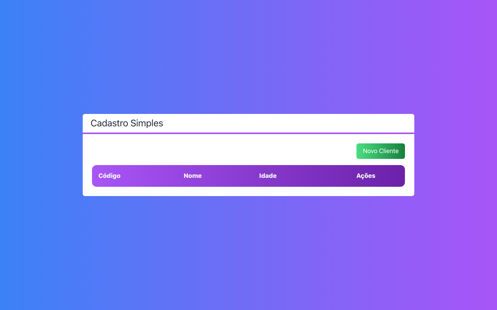

# CRUD Next.js




> Projeto de um Todo App para exercicio de CRUD no framework Next.js

## 🚀 Acesse o projeto em:

https://crud-nextjs-weld.vercel.app/

## Instalando CRUD Next.js

Para instalar o CRUD Next.js, siga estas etapas:

Abra o terminal na pasta do repositório e inicie o server de desenvolvimento:

```bash
npm run dev
# ou
yarn dev
```

Abra [http://localhost:3000](http://localhost:3000) com seu navegador de internet de escolha para ver o resultado.

[⬆ Voltar ao topo](#nome-do-projeto)<br>